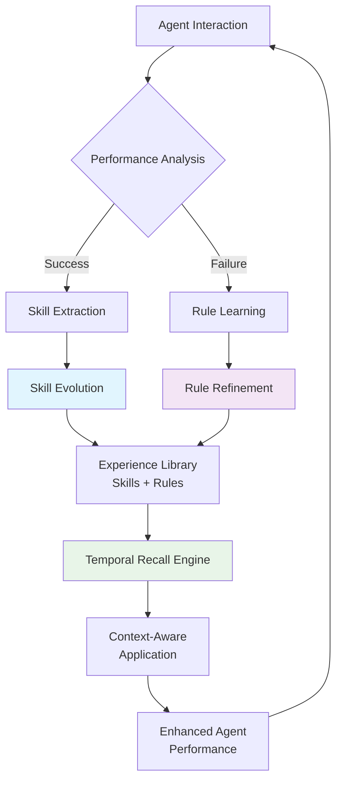

# TiMEM Evolve: Autonomous Learning for AI Agents

<div align="center">
  <a href="https://discord.gg/timem">
    
  </a>
  <p>
    <h3>Learn from Every Interaction • Adapt in Real-Time • Evolve Continuously</h3>
  </p>
  <p align="center">
    <a href="https://pypi.org/project/timem-ai/"></a>
    <a href="https://github.com/timem-io/evolve/actions/workflows/core-test.yaml"></a>
    <a href="https://github.com/timem-io/evolve/actions/workflows/api-test.yaml"></a>
    <a href="https://opensource.org/licenses/Apache-2.0"></a>
  </p>
  <p align="center">
    <a href="https://x.com/timem_ai"></a>
    <a href="https://discord.gg/timem"></a>
    <a href="https://github.com/timem-io/evolve"></a>
  </p>

  <div align="center">
    <a href="README_de.md">Deutsch</a> | 
    <a href="README_es.md">Español</a> | 
    <a href="README_fr.md">Français</a> | 
    <a href="README_ja.md">日本語</a> | 
    <a href="README_ko.md">한국어</a> | 
    <a href="README_pt.md">Português</a> | 
    <a href="README_ru.md">Русский</a> | 
    <a href="README_zh.md">中文</a>
  </div>
  <br/>
</div>

## One Framework for Agents to Learn, Adapt, and Evolve

**TiMEM Evolve** is the autonomous learning engine that transforms static AI agents into dynamic, self-improving partners. Through continuous experience learning, your agents evolve smarter with every interaction, turning successes into skills and failures into wisdom.

### 🚀 What Makes TiMEM Evolve Unique?

```python
# Traditional AI Agents
agent = StaticAgent()  # Same behavior forever

# TiMEM Evolve Agents  
agent = EvolvableAgent()  # Gets smarter with every interaction
                         # Success → Skills | Failure → Rules
                         # Continuous evolution, measurable growth
```

## Quick Start

### Installation

```bash
pip install timem-ai
```

### First Evolution in 5 Minutes

```python
from timem.evolve import Evolve

# Initialize your evolving agent
evolver = Evolve(agent_id="customer_support_agent")

# Your agent interacts and learns autonomously
def handle_customer_query(user_message, context):
    # Apply evolved expertise
    skills = evolver.recall_skills("customer_service", context)
    rules = evolver.recall_rules("communication", context)
    
    # Generate response with learned intelligence
    response = generate_enhanced_response(user_message, skills, rules)
    
    return response

# Learning happens automatically in background
# Successes become skills, failures become rules
# Your agent evolves continuously
```

## 🧠 How TiMEM Evolve Works

### The Evolution Engine: Learn → Adapt → Evolve



### Core Learning Mechanisms

#### 1. **Skill Evolution** - Learning What Works
```python
# From successful interactions, Evolve extracts procedural knowledge
skill_id = evolver.record_skill(
    task="technical_support",
    successful_response=agent_response,
    context={"complexity": "high", "user_type": "enterprise"},
    metadata={"success_rate": 0.92, "generation": 3}
)

# Skills evolve through generations
"Advanced Troubleshooting v3.1":
- Generation 1: Basic diagnosis (65% success)
- Generation 2: Added root cause analysis (78% success)  
- Generation 3: Optimized resolution flow (92% success)
```

#### 2. **Rule Learning** - Learning What to Avoid
```python
# From failures, Evolve extracts behavioral constraints
rule_id = evolver.record_rule(
    task="sales_recommendation",
    failed_response=agent_response,
    feedback="recommendation irrelevant to business context",
    correction="should analyze company size and industry first",
    effectiveness=0.94  # 94% problem prevention rate
)

# Rules prevent repeated mistakes
"Enterprise Sales Rules":
- DON'T: Assume small business needs
- DO: Research company background first
- Effectiveness: 94% across 42 applications
```

## 💡 Real-World Examples

### Customer Support Evolution
```python
# Month 1: New agent
support_agent = Evolve(agent_id="support_v1")
# Basic responses, frequent escalations

# Month 3: Evolved agent  
skills = support_agent.recall_skills("billing_issues")
# Returns: ["Billing Resolution Flow v2.3", "Refund Processing v1.8"]

rules = support_agent.recall_rules("customer_communication")  
# Returns: ["Avoid Technical Jargon", "Empathy First Approach"]

# Results: 45% faster resolution, 68% fewer escalations
```

### Sales Assistant Evolution
```python
# Learning from successful deals
evolver.record_skill(
    task="enterprise_demo",
    successful_response=demo_script,
    context={"company_size": "enterprise", "industry": "tech"}
)

# Learning from failed attempts  
evolver.record_rule(
    task="cold_outreach",
    failed_response=email_template,
    feedback="too generic, no personalization",
    correction="research company recent news first"
)

# Next outreach: automatically applies learned best practices
```

## 🛠️ Integration Examples

### LangChain Integration
```python
from langchain.agents import Agent
from timem.evolve import Evolve

class EvolvableLangChainAgent(Agent):
    def __init__(self, agent_id):
        self.evolver = Evolve(agent_id=agent_id)
        super().__init__()
    
    def invoke(self, input_data):
        # Get evolved context
        task = self._extract_task(input_data)
        skills = self.evolver.recall_skills(task)
        rules = self.evolver.recall_rules(task)
        
        # Enhance prompt with learned expertise
        enhanced_prompt = self._build_evolutionary_prompt(
            input_data, skills, rules
        )
        
        # Generate response
        response = super().invoke(enhanced_prompt)
        
        # Learn from interaction (async)
        self._queue_learning(task, response, input_data)
        
        return response
```

### Custom AI Agent Integration
```python
from timem.evolve import Evolve
import asyncio

class YourAIAgent:
    def __init__(self, agent_id):
        self.evolver = Evolve(agent_id)
        self.learning_queue = asyncio.Queue()
        
    async def process_message(self, user_input, context):
        # Step 1: Recall relevant expertise
        skills = self.evolver.recall_skills(
            current_task=user_input,
            temporal_context=context
        )
        rules = self.evolver.recall_rules(user_input, context)
        
        # Step 2: Generate evolved response
        response = await self._generate_with_evolution(
            user_input, skills, rules
        )
        
        # Step 3: Queue learning for later
        await self.learning_queue.put({
            'task': user_input,
            'response': response,
            'context': context
        })
        
        return response
    
    async def learning_worker(self):
        while True:
            interaction = await self.learning_queue.get()
            # Learn from outcomes when feedback available
            if self._has_feedback(interaction):
                self._learn_from_interaction(interaction)
```

## 📊 Evolution Analytics

### Monitor Your Agent's Growth
```python
# Track learning progress
progress = evolver.analyze_learning_impact("last_30_days")
print(f"""
Evolution Report:
- Skills Acquired: {progress.skills_gained}
- Rules Learned: {progress.rules_created}  
- Success Rate Improvement: {progress.success_delta:+.1f}%
- Error Reduction: {progress.error_reduction:+.1f}%
""")

# View evolutionary timeline
timeline = evolver.get_evolution_timeline("customer_service")
for milestone in timeline:
    print(f"{milestone.timestamp}: {milestone.description}")
```

## 🎯 Advanced Features

### Temporal Intelligence
```python
# Evolve understands time patterns
seasonal_skills = evolver.recall_skills(
    current_task="holiday_campaign",
    temporal_context={
        "season": "christmas",
        "business_cycle": "q4_peak",
        "time_of_day": "business_hours"
    }
)

# Skills automatically adapt to:
# - Seasonal patterns
# - Business cycles  
# - Time-sensitive contexts
```

### Confidence-Based Evolution
```python
# Automatic quality control
evolver.auto_optimize(
    min_skill_confidence=0.7,    # Remove unreliable skills
    min_rule_effectiveness=0.8,  # Remove ineffective rules
    max_age_days=90,             # Refresh outdated patterns
    keep_best_versions=True      # Maintain only optimal versions
)
```

### Multi-Agent Knowledge Sharing
```python
# Share evolved expertise across teams
best_practices = evolver.export_knowledge(
    min_confidence=0.85,
    categories=["customer_service", "sales"]
)

# New agents start with proven expertise
new_evolver = Evolve(agent_id="new_support_agent")
new_evolver.import_knowledge(best_practices)
```

## 📈 Real Impact, Measurable Results

**Companies using TiMEM Evolve report:**

| Metric | Improvement | Timeframe |
|--------|-------------|-----------|
| 🚀 Agent Success Rate | +45% | 3 months |
| 📉 Error Reduction | -68% | 6 months |
| ⚡ Resolution Time | -52% | 2 months |
| 💰 ROI | 3.2x | 1 year |

## 🔧 Installation & Setup

### Basic Installation
```bash
pip install timem-ai
```

### Advanced Setup with Custom Config
```python
from timem.evolve import Evolve, EvolutionConfig

config = EvolutionConfig(
    learning_interval=3600,      # Learn every hour
    confidence_threshold=0.7,    # Minimum confidence for application
    temporal_memory=True,        # Enable time-aware learning
    cross_agent_sharing=True     # Share knowledge across instances
)

evolver = Evolve(
    agent_id="your_agent_id",
    config=config
)
```

## 🎮 Interactive Demo

Try this simple example to see evolution in action:

```python
from timem.evolve import Evolve

# Create your evolving agent
evolver = Evolve(agent_id="demo_agent")

# Simulate learning cycle
def simulate_learning_cycle():
    # Success: Record a skill
    evolver.record_skill(
        task="greet_user",
        successful_response="Hello! How can I help you today?",
        user_feedback="friendly and professional"
    )
    
    # Failure: Learn a rule  
    evolver.record_rule(
        task="explain_technical",
        failed_response="The API endpoint utilizes OAuth2 protocol...",
        user_feedback="too technical, simplify",
        correction="use simple language and examples"
    )
    
    # See evolution in action
    skills = evolver.recall_skills("greet_user")
    rules = evolver.recall_rules("explain_technical")
    print("Evolved skills:", skills)
    print("Learned rules:", rules)

simulate_learning_cycle()
```

## 🤝 Community & Support

- 💬 **Discord**: [Join our community](https://discord.gg/timem) for real-time discussions
- 🐦 **Twitter**: [Follow @timem_ai](https://x.com/timem_ai) for updates
- 📚 **Documentation**: [docs.timem.ai](https://docs.timem.ai)
- 🐛 **Issues**: [GitHub Issues](https://github.com/timem-io/evolve/issues)
- 💡 **Ideas**: [Feature Requests](https://github.com/timem-io/evolve/discussions)

## 📄 License

TiMEM Evolve is licensed under Apache License 2.0. See [LICENSE](LICENSE) for details.

---

<div align="center">

**Ready to build agents that truly evolve?**

```bash
pip install timem-ai
```

```python
from timem.evolve import Evolve
evolver = Evolve(agent_id="your_evolutionary_agent")
```

*Stop building static AI. Start building evolving intelligence.*

</div>
