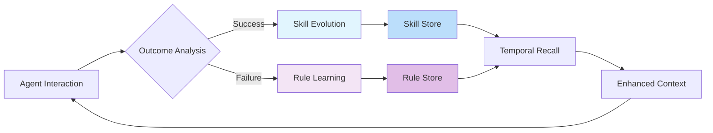

# TiMEM Evolution: Autonomous Learning for AI Agents

<div align="center">
  <a href="https://discord.gg/timem">
    
  </a>
  <p>
    <h3>Store Experiences ➡️ Observe Patterns ➡️ Evolve Skills & Rules</h3>
  </p>
  <p align="center">
    <a href="https://pypi.org/project/timem/"></a>
    <a href="https://www.npmjs.com/package/timem"></a>
    <a href="https://github.com/timem-io/evolution/actions/workflows/core-test.yaml"></a>
    <a href="https://github.com/timem-io/evolution/actions/workflows/api-test.yaml"></a>
  </p>
  <p align="center">
    <a href="https://x.com/timem_ai"></a>
    <a href="https://discord.gg/timem"></a>
    <a href="https://github.com/timem-io/evolution"></a>
  </p>

  <div align="center">
    <a href="README_de.md">Deutsch</a> | 
    <a href="README_es.md">Español</a> | 
    <a href="README_fr.md">Français</a> | 
    <a href="README_ja.md">日本語</a> | 
    <a href="README_ko.md">한국어</a> | 
    <a href="README_pt.md">Português</a> | 
    <a href="README_ru.md">Русский</a> | 
    <a href="README_zh.md">中文</a>
  </div>
  <br/>
</div>

## One Framework for Agents to Learn, Adapt, and Evolve

TiMEM Evolution is the autonomous learning framework within the TiMEM platform that enables AI agents to continuously improve by learning from every interaction. Agents evolve through temporal experience, getting smarter with each success and learning from every failure.

**TiMEM Evolution enables agents to:**

- **Learn Skills** from successful interactions
- **Learn Rules** from failures and feedback  
- **Autonomously Evolve** through continuous experience
- **Apply Learned Expertise** in real-time

<div align="center">
  <picture>
    
  </picture>
  <p>How TiMEM Evolution Learns and Evolves Your Agents</p>
</div>

## Why TiMEM Evolution?

We built TiMEM Evolution because experience-driven learning transforms AI agents from static tools into adaptive partners:

- **Build self-improving agents** that learn continuously without manual retraining
- **Reduce repeated errors** by systematically learning from mistakes  
- **Accelerate agent maturity** through proven skill evolution
- **Create measurable learning curves** with clear evolutionary metrics

## Core Concepts

### Skills - Evolved Success Patterns
**Skills** are reusable success patterns distilled from repeated successful interactions. Each skill evolves through generations:

```python
"Customer Service Skill v3.2":
- Success Rate: 92% (from 65% initial)
- Generations: 3 major improvements
- Applications: 47 successful uses
```

### Rules - Learned Guardrails  
**Rules** are behavioral constraints distilled from failures and negative feedback:

```python
"Technical Communication Rule v2.1":
- Effectiveness: 94% problem prevention  
- Applications: 42 successful constraints
- Confidence: High (consistently validated)
```

### Evolutionary Timeline
Every skill and rule maintains a complete timeline showing how it adapts over time through natural selection of the most effective behaviors.

### Learning Confidence
Skills and rules carry confidence scores that evolve based on successful applications and positive outcomes.

## Quick Start

### Installation

```bash
pip install timem-ai
```

### Enable Evolutionary Learning

```python
from timem.evolution import Evolution

# Initialize evolutionary learning
evo = Evolution(agent_id="customer_support_agent")

# Learn from successes and failures
skill_id = evo.record_skill(
    task="回复客户邮件",
    successful_response=response,
    user_feedback="满意",
    context={"topic": "billing"}
)

rule_id = evo.record_rule(
    task="产品推荐", 
    failed_response=response,
    user_feedback="太啰嗦了",
    correction="请简洁推荐",
    context={"user_type": "vip"}
)

# Apply learned expertise
skills = evo.recall_skills("回复客户邮件", context={"topic": "billing"})
rules = evo.recall_rules("产品推荐", context={"user_type": "vip"})
```

## Core Workflows

### 1. Skill Evolution: Learning What Works

```python
# Record successful patterns
skill_id = evo.record_skill(
    task="technical_support",
    successful_response=agent_response,
    context={"complexity": "high", "user_type": "enterprise"}
)

# Recall evolved skills
applicable_skills = evo.recall_skills(
    current_task="premium_support",
    context={"urgency": "high", "customer_tier": "vip"}
)
```

### 2. Rule Evolution: Learning What to Avoid

```python
# Learn from failures
rule_id = evo.record_rule(
    task="sales_recommendation",
    failed_response=agent_response,
    feedback="recommendation irrelevant to business needs",
    correction="should ask about company size and industry first"
)

# Apply learned constraints
active_rules = evo.recall_rules(
    current_task="enterprise_sales",
    context={"risk_profile": "high_value"}
)
```

### 3. Management & Analytics

```python
# Manage learned content
evo.disable_rule(rule_id)
evo.promote_skill(skill_id)

# Analyze learning impact
impact = evo.analyze_learning_impact("last_7_days")
evolution_report = evo.get_evolution_timeline("customer_service")
```

## Advanced Features

### Temporal Pattern Matching
```python
# Skills adapt to contextual patterns
seasonal_skills = evo.recall_skills(
    current_task="holiday_marketing",
    context={"season": "christmas", "business_cycle": "peak"}
)
```

### Confidence-Based Evolution
```python
# Automatic optimization
evo.auto_optimize(
    min_confidence=0.7,    # Remove low-confidence learnings
    max_age_days=90        # Refresh old patterns
)
```

## Framework Integration

### LangChain Integration
```python
from langchain.agents import Agent
from timem.evolution import Evolution

class EvolvableAgent(Agent):
    def __init__(self, agent_id):
        self.evolution = Evolution(agent_id=agent_id)
    
    def get_enhanced_context(self, task, context):
        skills = self.evolution.recall_skills(task, context)
        rules = self.evolution.recall_rules(task, context)
        return self._build_evolutionary_context(skills, rules)
```

### Custom Integration
```python
from timem.evolution import Evolution

class YourAgent:
    def __init__(self, agent_id):
        self.evolution = Evolution(agent_id)
    
    def process_with_learning(self, task, input_data):
        # Apply learned expertise
        skills = self.evolution.recall_skills(task)
        rules = self.evolution.recall_rules(task)
        
        # Process with evolutionary intelligence
        response = self.generate(skills, rules, input_data)
        
        # Learn from outcome
        if user_feedback.positive:
            self.evolution.record_skill(task, response, user_feedback)
        else:
            self.evolution.record_rule(task, response, user_feedback)
        
        return response
```

## Complete TiMEM Architecture

```python
# TiMEM Platform - Core Infrastructure
from timem import Memory, Agent

# General purpose storage
memory = Memory(agent_id="my_agent")
memory.add("conversation_history", messages)
results = memory.search("technical issues")

# TiMEM Evolution - Learning Framework
from timem.evolution import Evolution

# Experience-based learning
evo = Evolution(agent_id="my_agent")
skills = evo.recall_skills("customer_support")
rules = evo.recall_rules("sales_dialogue")
```

## Real-World Impact

Companies using TiMEM Evolution report:

- **45% faster agent maturation** through systematic learning
- **68% reduction in repeated errors** via constraint learning  
- **3.2x ROI** on AI investments through continuous improvement
- **92% adoption rate** of learned skills in relevant contexts

## Dashboard & Monitoring

TiMEM Evolution includes comprehensive monitoring within the TiMEM platform:

<div align="center">
  <picture>
    
  </picture>
  <p>Monitor Skill Evolution and Learning Impact</p>
</div>

## How They Work Together



## Join the Evolution

### Get Started
```bash
pip install timem-ai
```

### Community
- 💬 [Join our Discord](https://discord.gg/timem) for discussions and support
- 🐦 [Follow us on Twitter](https://x.com/timem_ai) for latest developments  
- 📚 [Documentation](https://docs.timem.ai) at docs.timem.ai
- 🌐 [TiMEM Platform](https://timem.ai) at timem.ai

## License

TiMEM Evolution is licensed under Apache License 2.0.

---

**Ready to evolve your AI agents?** Start with TiMEM Evolution today and build agents that truly learn from experience.

```python
from timem.evolution import Evolution
evo = Evolution(agent_id="your_agent")
```

*Transform your agents from static tools to evolving partners with TiMEM Evolution - the learning framework within the TiMEM platform.*
